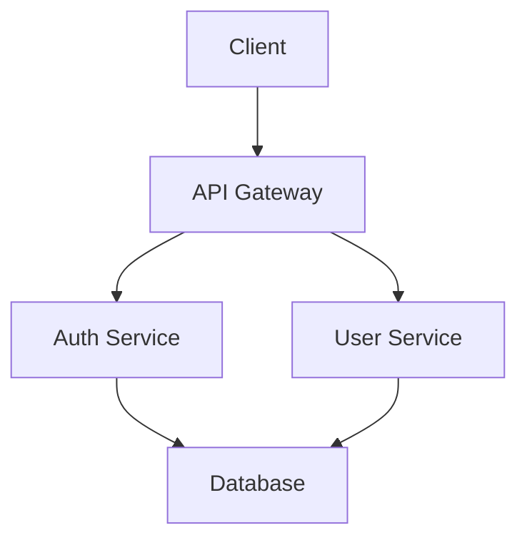

# 📋 TODO - Implementación de Archivos .agent/ para Agentes IA

## 🏗️ Visión General

Este documento lista TODOS los issues a implementar para que cada archivo del directorio `.agent/` sea **100% funcional** para que agentes IA puedan entender y trabajar con cualquier proyecto de API sin esfuerzo.

**Meta**: Agentes IA leen 1 archivo y saben TODO lo que necesitan del proyecto.

---

## 📁 1. ARCHITECTURE.md

### Issues a Implementar:

```
ISSUE-A1: Detectar automáticamente la arquitectura del sistema
- Detectar: monolito, microservicios, serverless
- Detectar: patrones (MVC, hexagonal, clean architecture)
- Output: Diagrama en ASCII o Mermaid

ISSUE-A2: Detectar tecnologías del proyecto
- Frontend: React, Vue, Angular, etc.
- Backend: Spring, Express, Django, FastAPI, etc.
- Database: PostgreSQL, MongoDB, Redis, etc.
- Message queues: Kafka, RabbitMQ, etc.

ISSUE-A3: Generar diagrama de componentes
- Lista de servicios
- Conexiones entre servicios
- Bases de datos usadas
- APIs externas

ISSUE-A4: Detectar dependencias entre servicios
- Qué servicio llama a cuál
- Orden de inicialización
- Health checks entre servicios
```

### Template Generado:

```markdown
# Arquitectura del Proyecto

## Tipo de Aplicación
- [ ] Monolito
- [ ] Microservicios
- [ ] Serverless

## Tecnologías Detectadas
| Componente | Tecnología | Versión |
|------------|------------|---------|
| Backend | Spring Boot | 3.2.x |
| Database | PostgreSQL | 15 |
| Cache | Redis | 7 |

## Diagrama de Arquitectura


## Servicios
| Servicio | Puerto | Puerto Docker |
|----------|--------|---------------|
| auth-service | 8085 | 8085:8085 |
| user-service | 8086 | 8086:8086 |
```

---

## 📁 2. ENDPOINTS.md

### Issues a Implementar:

```
ISSUE-E1: Extraer todos los endpoints REST automáticamente
- Leer código fuente (cualquier lenguaje)
- Detectar: @RestController, @RequestMapping, @GetMapping, etc.
- Detectar: FastAPI @app.get, @router.get
- Detectar: Express router.get, router.post

ISSUE-E2: Detectar parámetros de cada endpoint
- Path params: /users/{id}
- Query params: /users?page=1&limit=10
- Headers requeridos
- Body requerido

ISSUE-E3: Generar ejemplos de request/response
- Ejecutar endpoint (si hay datos de prueba)
- Generar JSON example
- Documentar status codes

ISSUE-E4: Detectar autenticación requerida
- @PreAuthorize, @Secured
- JWT, OAuth, API Keys
- Detectar token endpoint
```

### Template Generado:

```markdown
# Endpoints REST

## Autenticación

### POST /auth/login
Iniciar sesión de usuario.

**Headers:**
```
Content-Type: application/json
```

**Request:**
```json
{
  "email": "user@example.com",
  "password": "password123"
}
```

**Response 200:**
```json
{
  "status": 200,
  "message": "Login successful",
  "data": {
    "accessToken": "eyJhbG...",
    "refreshToken": "eyJhbG...",
    "expiresIn": 3600
  }
}
```

**Response 401:**
```json
{
  "status": 401,
  "message": "Invalid credentials"
}
```

### GET /auth/getUserById/{id}
Obtener usuario por ID.

**Headers:**
```
Authorization: Bearer {token}
```

**Path Parameters:**
| Nombre | Tipo | Requerido | Descripción |
|--------|------|-----------|-------------|
| id | UUID | Sí | ID del usuario |

**Response 200:**
```json
{
  "status": 200,
  "data": {
    "id": "uuid",
    "username": "john",
    "email": "john@example.com"
  }
}
```
```

---

## 📁 3. WEBSOCKET_EVENTS.md

### Issues a Implementar:

```
ISSUE-W1: Detectar eventos WebSocket del servidor
- Buscar: @OnMessage, @SocketIO.on, socket.on
- Listar eventos emitodos
- Listar eventos recibidos

ISSUE-W2: Documentar formato de mensajes
- Estructura JSON de cada evento
- Tipos de datos
- Campos requeridos/opcionales

ISSUE-W3: Detectar rooms/channels
- Salas públicas y privadas
- Suscripciones
- Permisos

ISSUE-W4: Generar código de ejemplo de conexión
- Cliente WebSocket básico
- Suscripción a eventos
- Manejo de errores
```

### Template Generado:

```markdown
# Eventos WebSocket

## Conexión

```python
import socketio

sio = socketio.Client()

@sio.on('connect')
def on_connect():
    print('Connected to server')

@sio.on('disconnect')
def on_disconnect():
    print('Disconnected from server')
```

## Eventos del Servidor

### user:joined
Un usuario se unió a una sala.

```json
{
  "event": "user:joined",
  "data": {
    "userId": "uuid",
    "username": "john",
    "roomId": "room-123"
  }
}
```

### message:new
Nuevo mensaje recibido.

```json
{
  "event": "message:new",
  "data": {
    "id": "uuid",
    "content": "Hello world",
    "userId": "uuid",
    "timestamp": "2024-01-01T12:00:00Z"
  }
}
```

## Eventos del Cliente

### message:send
Enviar mensaje.

```json
{
  "event": "message:send",
  "data": {
    "roomId": "room-123",
    "content": "Hello world"
  }
}
```

### room:join
Unirse a una sala.

```json
{
  "event": "room:join",
  "data": {
    "roomId": "room-123"
  }
}
```
```

---

## 📁 4. GRPC_SERVICES.md

### Issues a Implementar:

```
ISSUE-G1: Extraer definiciones protobuf
- Buscar archivos .proto
- Parsear servicios y métodos
- Detectar request/response types

ISSUE-G2: Detectar streaming
- Client streaming
- Server streaming
- Bidirectional streaming

ISSUE-G3: Generar código cliente
- Stub para Python
- Stub para otros lenguajes
- Ejemplos de llamada

ISSUE-G4: Documentar autenticación gRPC
- TLS/SSL
- JWT en metadata
- OAuth2
```

### Template Generado:

```markdown
# Servicios gRPC

## UserService

```protobuf
service UserService {
  // Obtener usuario por ID
  rpc GetUser (GetUserRequest) returns (User);
  
  // Crear usuario
  rpc CreateUser (CreateUserRequest) returns (User);
  
  // Stream de usuarios en tiempo real
  rpc StreamUsers (GetUsersRequest) returns (stream User);
  
  // Streaming bidireccional
  rpc Chat (stream ChatMessage) returns (stream ChatMessage);
}
```

### Métodos

#### GetUser
```python
import grpc
import user_service_pb2
import user_service_pb2_grpc

stub = user_service_pb2_grpc.UserServiceStub(channel)
response = stub.GetUser(user_service_pb2.GetUserRequest(id="uuid"))
print(response)  # User(id="uuid", username="john", email="john@example.com")
```

#### CreateUser
```python
response = stub.CreateUser(user_service_pb2.CreateUserRequest(
    username="john",
    email="john@example.com",
    password="password123"
))
```

### Tipos de Datos

```protobuf
message User {
  string id = 1;
  string username = 2;
  string email = 3;
  int64 created_at = 4;
}

message GetUserRequest {
  string id = 1;
}
```
```

---

## 📁 5. DATA_SCHEMAS.md

### Issues a Implementar:

```
ISSUE-D1: Extraer todos los DTOs/Models
- Detectar: Java classes, Python Pydantic, TypeScript interfaces
- Extraer campos con tipos
- Detectar validaciones (@NotNull, @Min, regex, etc.)

ISSUE-D2: Detectar enums
- Valores posibles
- Descripciones

ISSUE-D3: Detectar relaciones entre entidades
- One-to-One
- One-to-Many
- Many-to-Many

ISSUE-D4: Generar schemas en diferentes formatos
- JSON Schema
- OpenAPI
- TypeScript interfaces
```

### Template Generado:

```markdown
# Data Schemas

## User

| Campo | Tipo | Requerido | Validación |
|-------|------|-----------|------------|
| id | UUID | Auto | - |
| username | String | Sí | 3-50 caracteres |
| email | String | Sí | Formato email válido |
| password | String | Sí | Mínimo 6 caracteres |
| role | Enum | Sí | ADMIN, USER, GUEST |
| createdAt | DateTime | Auto | - |
| updatedAt | DateTime | Auto | - |

```json
{
  "id": "uuid",
  "username": "john_doe",
  "email": "john@example.com",
  "role": "USER",
  "createdAt": "2024-01-01T12:00:00Z",
  "updatedAt": "2024-01-01T12:00:00Z"
}
```

## Enum: Role

| Valor | Descripción |
|-------|-------------|
| ADMIN | Acceso completo al sistema |
| USER | Usuario regular |
| GUEST | Solo lectura |
```

---

## 📁 6. AUTH_FLOWS.md

### Issues a Implementar:

```
ISSUE-AF1: Documentar flujo de registro
- Pasos completos
- Validaciones
- Email verification
- Response esperado

ISSUE-AF2: Documentar flujo de login
- Credenciales
- Tokens recibidos
- Refresh token

ISSUE-AF3: Documentar flujo de password reset
- Solicitar reset
- Email con token
- Nueva contraseña

ISSUE-AF4: Documentar flujo de OAuth
- Proveedores (Google, GitHub, etc.)
- URLs de redirect
- Scopes
```

### Template Generado:

```markdown
# Flujos de Autenticación

## 1. Registro de Usuario

```
┌──────────┐    POST /auth/register     ┌──────────┐
│  Client  │ ─────────────────────────► │  Server  │
│          │  {                         │          │
│          │    "email": "...",         │          │
│          │    "password": "..."       │          │
│          │  }                         │          │
│          │ ◄───────────────────────── │          │
└──────────┘     201 + JWT tokens        └──────────┘
```

**Request:**
```json
{
  "username": "john",
  "email": "john@example.com",
  "password": "password123"
}
```

**Response Exitoso (201):**
```json
{
  "status": 201,
  "data": {
    "user": {
      "id": "uuid",
      "username": "john",
      "email": "john@example.com"
    },
    "accessToken": "eyJhbGc...",
    "refreshToken": "eyJhbGc...",
    "expiresIn": 3600
  }
}
```

## 2. Login

```
┌──────────┐    POST /auth/login       ┌──────────┐
│  Client  │ ─────────────────────────► │  Server  │
│          │  {                         │          │
│          │    "email": "...",        │          │
│          │    "password": "..."       │          │
│          │  }                         │          │
│          │ ◄───────────────────────── │          │
└──────────┘     200 + JWT tokens        └──────────┘
```

## 3. Refresh Token

```
┌──────────┐  POST /auth/token/refresh  ┌──────────┐
│  Client  │ ─────────────────────────► │  Server  │
│          │  {                         │          │
│          │    "refreshToken": "..."  │          │
│          │  }                         │          │
│          │ ◄───────────────────────── │          │
└──────────┘     200 + nuevos tokens    └──────────┘
```
```

---

## 📁 7. ERROR_CODES.md

### Issues a Implementar:

```
ISSUE-EC1: Recopilar todos los códigos de error
- Del código fuente
- De la documentación
- De respuestas conocidas

ISSUE-EC2: Clasificar errores
- Errores de cliente (4xx)
- Errores de servidor (5xx)
- Errores de autenticación
- Errores de validación

ISSUE-EC3: Proporcionar soluciones
- Causa común
- Cómo resolver
- Ejemplo de request correcto
```

### Template Generado:

```markdown
# Códigos de Error

## Errores de Autenticación

| Código | HTTP | Descripción | Solución |
|--------|------|-------------|----------|
| AUTH001 | 401 | Token inválido | Obtener nuevo token con /auth/login |
| AUTH002 | 401 | Token expirado | Usar refresh token |
| AUTH003 | 403 | Acceso denegado | Verificar permisos |
| AUTH004 | 400 | Credenciales inválidas | Verificar email/password |

## Errores de Validación

| Código | HTTP | Campo | Descripción |
|--------|------|-------|-------------|
| VAL001 | 400 | email | Email inválido |
| VAL002 | 400 | password | Mínimo 6 caracteres |
| VAL003 | 400 | username | 3-50 caracteres, sin espacios |

## Errores de Recurso

| Código | HTTP | Descripción |
|--------|------|-------------|
| RES001 | 404 | Usuario no encontrado |
| RES002 | 409 | Email ya existe |
| RES003 | 409 | Username ya existe |

## Errores de Servidor

| Código | HTTP | Descripción |
|--------|------|-------------|
| ERR001 | 500 | Error interno del servidor |
| ERR002 | 503 | Servicio no disponible |
| ERR003 | 504 | Timeout |
```

---

## 📁 8. TEST_PATTERNS.md

### Issues a Implementar:

```
ISSUE-TP1: Definir patrones de test por tipo de endpoint
- CRUD básico
- Autenticación
- Búsqueda/filtro
- Paginación

ISSUE-TP2: Proporcionar templates por escenario
- Happy path
- Casos límite
- Errores
- Concurrencia

ISSUE-TP3: Generar tests automáticamente
- Ejecutar e2e generate-tests
- Basado en endpoints detectados
- Cubrir casos comunes
```

### Template Generado:

```markdown
# Patrones de Testing

## 1. Patrón CRUD

### Create (POST)
```python
def test_create_user():
    """Test: Crear usuario exitosamente"""
    # Arrange
    data = {
        "username": "newuser",
        "email": "new@example.com",
        "password": "password123"
    }
    
    # Act
    response = page.post("/users", data=data)
    
    # Assert
    assert response.status == 201
    assert response.json()["data"]["username"] == "newuser"
```

### Read (GET)
```python
def test_get_user():
    """Test: Obtener usuario por ID"""
    # Arrange - primero crear
    user_id = create_test_user()
    
    # Act
    response = page.get(f"/users/{user_id}")
    
    # Assert
    assert response.status == 200
    assert response.json()["data"]["id"] == user_id
```

## 2. Patrón de Error

```python
def test_create_user_invalid_email():
    """Test: Crear usuario con email inválido"""
    # Arrange
    data = {"email": "not-an-email"}
    
    # Act
    response = page.post("/users", data=data)
    
    # Assert
    assert response.status == 400
    assert "email" in response.json()["message"]
```

## 3. Patrón de Autenticación

```python
def test_authenticated_endpoint():
    """Test: Endpoint requiere autenticación"""
    # Sin token
    response = page.get("/users")
    assert response.status == 401
    
    # Con token válido
    token = login()
    response = page.get("/users", headers={"Authorization": f"Bearer {token}"})
    assert response.status == 200
```
```

---

## 📁 9. CRUD_TEMPLATES.md

### Issues a Implementar:

```
ISSUE-CR1: Detectar operaciones CRUD del sistema
- Qué entidades tienen CRUD
- Endpoints relacionados

ISSUE-CR2: Generar templates reutilizables
- Template por operación
- Con aserciones incluidas

ISSUE-CR3: Documentar casos especiales
- Soft delete
- Logical delete
- Timestamps automáticos
```

### Template Generado:

```markdown
# Plantillas CRUD

## User CRUD

### Create
```python
def create_user(username: str, email: str, password: str = "Test123456"):
    return page.post("/users", data={
        "username": username,
        "email": email,
        "password": password
    })

# Uso:
resp = create_user("john", "john@example.com")
user_id = resp.json()["data"]["id"]
```

### Read One
```python
def get_user(user_id: str):
    return page.get(f"/users/{user_id}")

# Uso:
resp = get_user(user_id)
user = resp.json()["data"]
```

### Read All (List)
```python
def list_users(page: int = 1, limit: int = 10):
    return page.get(f"/users?page={page}&limit={limit}")

# Uso:
resp = list_users(page=1, limit=20)
users = resp.json()["data"]["items"]
```

### Update
```python
def update_user(user_id: str, **kwargs):
    return page.put(f"/users/{user_id}", data=kwargs)

# Uso:
resp = update_user(user_id, username="newusername")
```

### Delete
```python
def delete_user(user_id: str):
    return page.delete(f"/users/{user_id}")

# Uso:
resp = delete_user(user_id)
assert resp.status == 204
```
```

---

## 📁 10. SECURITY_TESTS.md

### Issues a Implementar:

```
ISSUE-ST1: Tests de inyección
- SQL Injection
- XSS
- NoSQL Injection
- Command Injection

ISSUE-ST2: Tests de autenticación
- Broken authentication
- Session management
- Password policy

ISSUE-ST3: Tests de autorización
- IDOR (Insecure Direct Object References)
- Privilege escalation
- Path traversal

ISSUE-ST4: Tests de datos sensibles
- Exposed credentials
- Sensitive data in URL
- Missing encryption
```

### Template Generado:

```markdown
# Tests de Seguridad

## 1. SQL Injection

```python
def test_sql_injection_login():
    """Test: SQL Injection en login"""
    payloads = [
        "' OR '1'='1",
        "' OR '1'='1' --",
        "admin'--",
    ]
    
    for payload in payloads:
        response = page.post("/auth/login", data={
            "email": payload,
            "password": "anything"
        })
        # No debe revelar información
        assert response.status != 200 or "sql" not in response.text.lower()
```

## 2. XSS

```python
def test_xss_in_username():
    """Test: XSS en campo username"""
    payload = "<script>alert('XSS')</script>"
    response = page.post("/users", data={
        "username": payload,
        "email": "test@example.com",
        "password": "password"
    })
    # El servidor debe sanitizar o rechazar
    assert response.status in [400, 201]
```

## 3. IDOR

```python
def test_idor_user_access():
    """Test: Acceder a usuario de otro usuario"""
    # Login como usuario A
    token_a = login("usera")
    user_b_id = get_user_b_id()
    
    # Intentar acceder como usuario A
    response = page.get(
        f"/users/{user_b_id}",
        headers={"Authorization": f"Bearer {token_a}"}
    )
    # Debe ser 403 o 404, no 200
    assert response.status in [403, 404]
```
```

---

## 📁 11-22. ARCHIVOS RESTANTES

Para los siguientes archivos, los issues principales son:

### INTEGRATION_TESTS.md
```
ISSUE-IT1: Detectar flujos multi-endpoint
ISSUE-IT2: Generar tests de workflow
ISSUE-IT3: Documentar dependencias entre tests
```

### PERFORMANCE_TESTS.md
```
ISSUE-PT1: Definir SLAs
ISSUE-PT2: Templates de load testing
ISSUE-PT3: Templates de stress testing
```

### MOCK_EXTERNAL.md
```
ISSUE-ME1: Detectar APIs externas usadas
ISSUE-ME2: Generar configuración de mocks
ISSUE-ME3: Proporcionar respuestas por defecto
```

### DATABASE_SCHEMA.md
```
ISSUE-DB1: Extraer schema de BD
ISSUE-DB2: Detectar relaciones
ISSUE-DB3: Documentar índices
```

### ENVIRONMENT.md
```
ISSUE-ENV1: Detectar variables de entorno
ISSUE-ENV2: Clasificar por ambiente
ISSUE-ENV3: Proporcionar valores por defecto
```

### CI_CD_PIPELINE.md
```
ISSUE-CI1: Detectar CI/CD actual
ISSUE-CI2: Generar template de pipeline
ISSUE-CI3: Documentar secrets requeridos
```

### DEPENDENCIES.md
```
ISSUE-DEP1: Listar todas las dependencias
ISSUE-DEP2: Detectar versiones
ISSUE-DEP3: Documentar extras opcionales
```

### HEALTH_CHECKS.md
```
ISSUE-HC1: Detectar endpoints de health
ISSUE-HC2: Detectar liveness/readiness probes
ISSUE-HC3: Documentar dependencias de health
```

### RATE_LIMITS.md
```
ISSUE-RL1: Detectar rate limits
ISSUE-RL2: Documentar headers
ISSUE-RL3: Templates de prueba
```

### CHANGELOG.md
```
ISSUE-CL1: Extraer cambios de git
ISSUE-CL2: Clasificar por tipo
ISSUE-CL3: Detectar breaking changes
```

---

## 🎯 Priorización de Implementación

| Prioridad | Archivos | Issues |
|-----------|----------|--------|
| **ALTA** | ENDPOINTS.md, DATA_SCHEMAS.md, AUTH_FLOWS.md | E1-E4, D1-D4, AF1-AF4 |
| **MEDIA** | ERROR_CODES.md, TEST_PATTERNS.md, CRUD_TEMPLATES.md | EC1-EC3, TP1-TP3, CR1-CR3 |
| **BAJA** | WEBSOCKET_EVENTS.md, GRPC_SERVICES.md | W1-W4, G1-G4 |

---

## 🚀 Comandos del Framework

```bash
# Generar todos los archivos .agent/
e2e deep-scan /path/to/project

# Generar solo endpoints
e2e manifest /path/to/project

# Generar tests automáticamente
e2e generate-tests --service auth-service

# Ejecutar tests
e2e run --service auth-service

# Verificar configuración
e2e doctor
```

---

*Documento generado el 25 de febrero de 2026*
*Meta: Agentes IA leen y SABEN todo sin pensar*
