# SocialSeed E2E - Architecture Documentation

> **⚠️ IMPORTANT:** This document is the "Source of Truth" for all AI agents. Before implementing any new feature, agents MUST consult this document to ensure architectural consistency.
> 
> **Last Updated:** 2026-02-19
> **Auto-Update:** Enabled (scans `/src` directory automatically)

---

## Table of Contents

1. [System Macro-Architecture](#1-system-macro-architecture)
2. [Component Interdependency Map](#2-component-interdependency-map)
3. [Data Flow Specifications](#3-data-flow-specifications)
4. [Agent Role Definitions](#4-agent-role-definitions)
5. [Contract Section: External API Ingestion](#5-contract-section-external-api-ingestion)
6. [Module Registry](#6-module-registry)
7. [Auto-Update Mechanism](#7-auto-update-mechanism)

---

## 1. System Macro-Architecture

The SocialSeed E2E framework is built on a **multi-agent autonomous system** with an event-driven architecture. At the highest level, the system consists of three core pillars:

### 1.1 Core Pillars

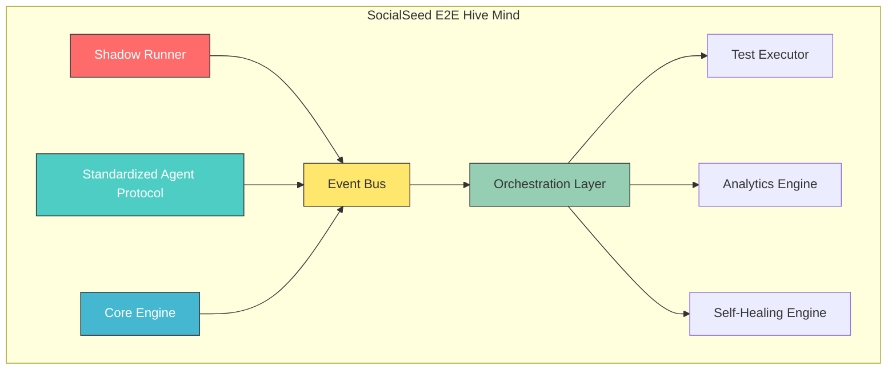

### 1.2 Shadow Runner

The **Shadow Runner** is responsible for capturing production traffic without impacting live systems. It operates in a passive monitoring mode.

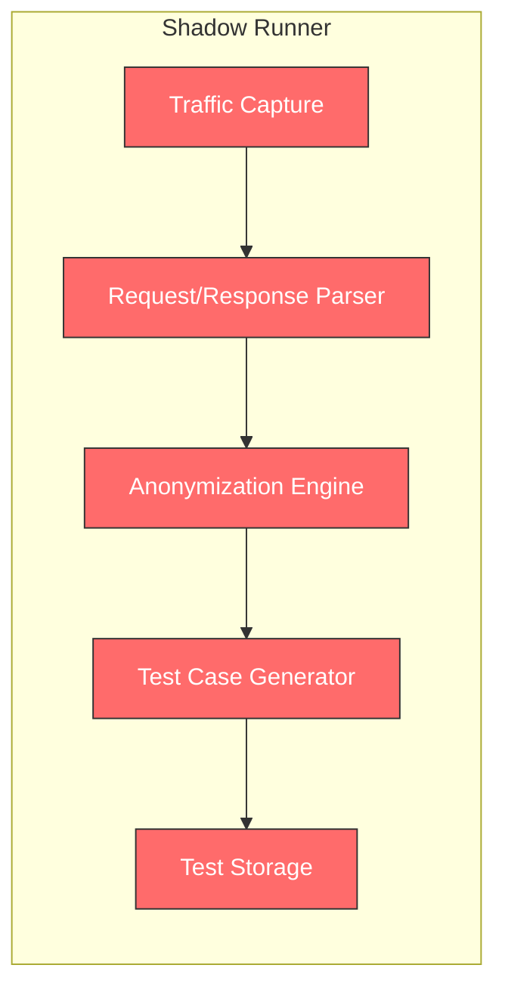

**Responsibilities:**
- Passive traffic capture (eBPF, proxy, log parsing)
- PII detection and anonymization
- Automatic test case generation from real traffic
- Historical traffic analysis for regression detection

### 1.3 Standardized Agent Protocol

The **Standardized Agent Protocol** defines how AI agents communicate, share context, and coordinate actions.

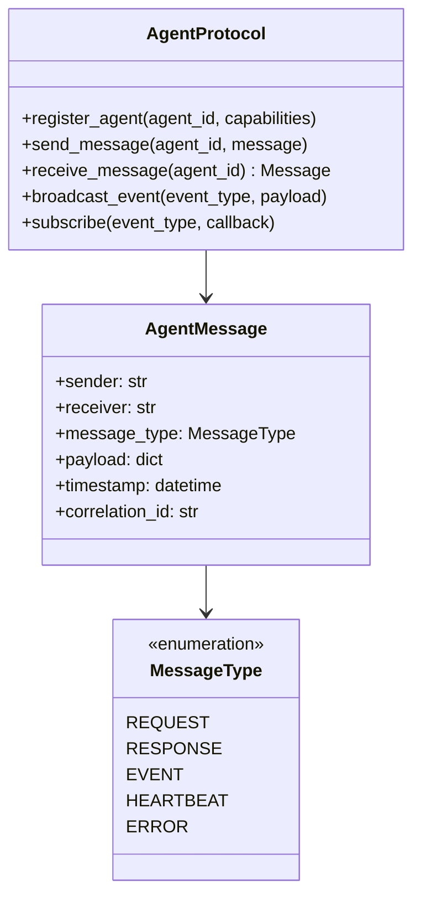

**Message Types:**
- `REQUEST`: Agent requests action from another agent
- `RESPONSE`: Response to a previous request
- `EVENT`: Asynchronous event notification
- `HEARTBEAT`: Health check between agents
- `ERROR`: Error notification

### 1.4 Core Engine

The **Core Engine** provides the fundamental testing capabilities.

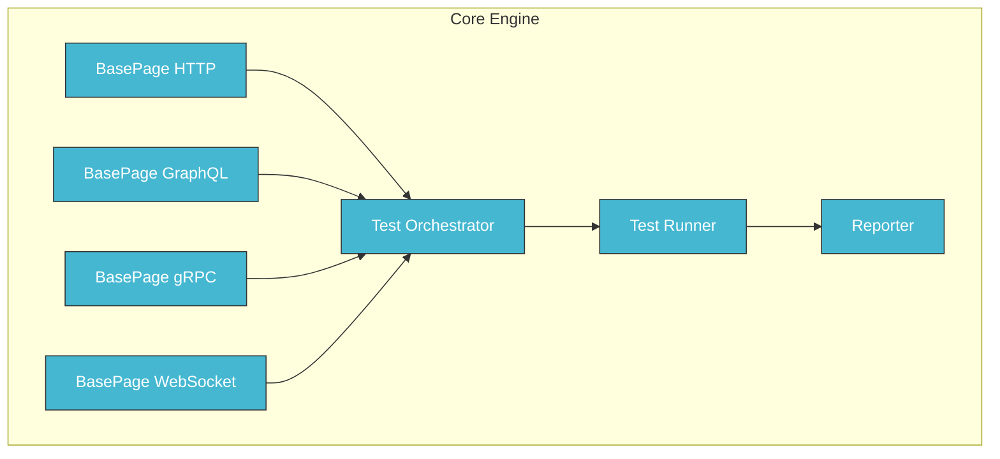

**Core Components:**
- `BasePage`: Protocol-agnostic API abstraction (REST, GraphQL, gRPC, WebSocket)
- `TestOrchestrator`: Discovers and manages test execution
- `TestRunner`: Executes tests using Playwright
- `Reporter`: Generates HTML/JSON reports with traceability

---

## 2. Component Interdependency Map

This section documents how components consume data from other components.

### 2.1 Key Dependencies

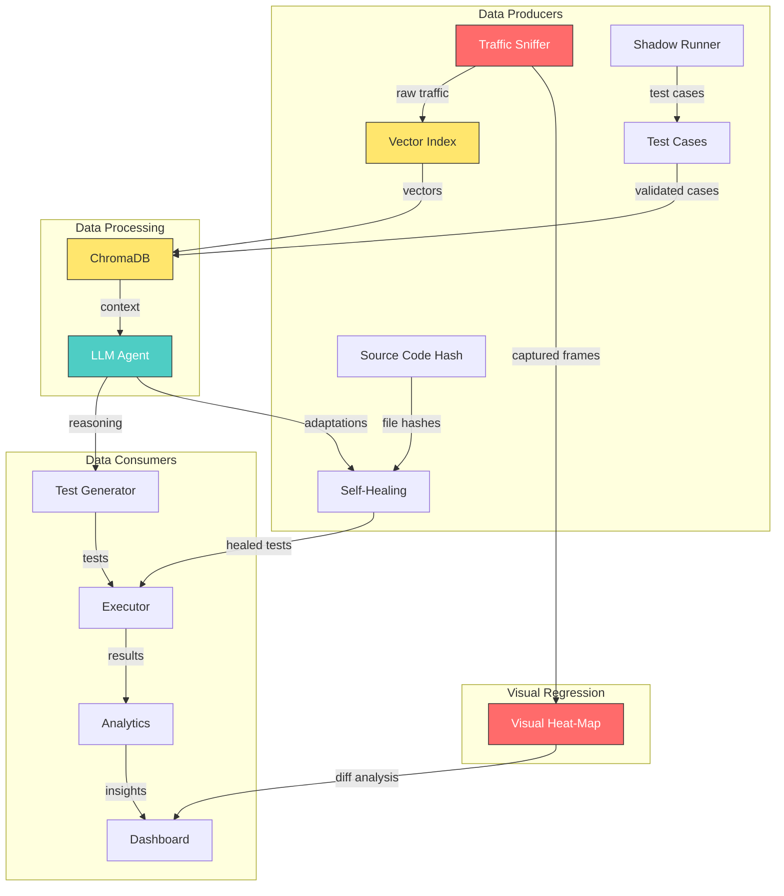

### 2.2 Component Relationships Table

| Producer | Consumer | Data Flow | Protocol |
|----------|----------|-----------|----------|
| Traffic Sniffer | Vector Index | Raw captured traffic | Internal API |
| Shadow Runner | Test Cases | Generated test cases | File System |
| Source Code Hash | Self-Healing | File change detection | Internal API |
| Vector Index | ChromaDB | Embeddings | Internal API |
| ChromaDB | LLM Agent | Context retrieval | Internal API |
| LLM Agent | Test Generator | Reasoning output | Internal API |
| LLM Agent | Self-Healing | Adaptation suggestions | Internal API |
| Visual Heat-Map | Dashboard | Diff visualization | HTTP/WebSocket |

### 2.3 Source Code Hash ↔ Self-Healing Integration

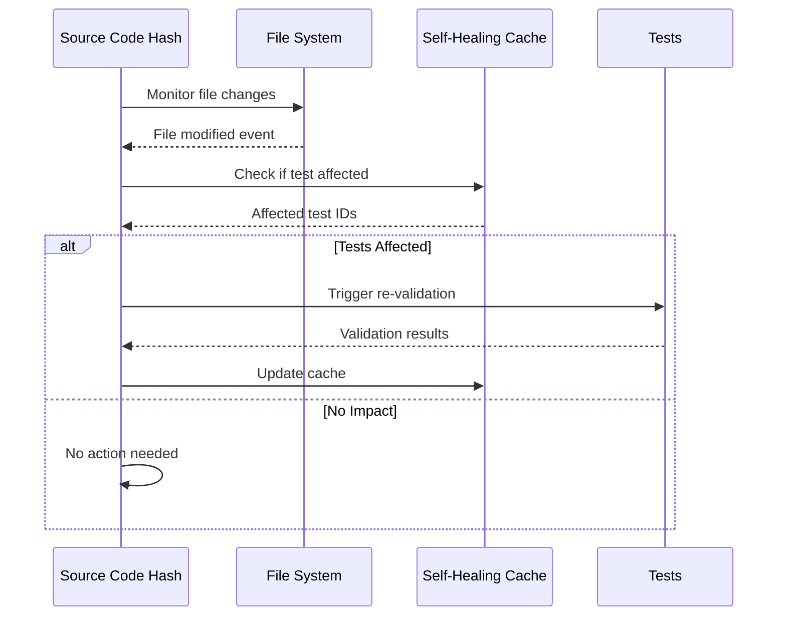

---

## 3. Data Flow Specifications

The complete data flow from traffic capture to analytics.

### 3.1 End-to-End Data Pipeline

```mermaid
flowchart LR
    subgraph "Capture Phase"
        A[eBPF/Pcap] --> B(Traffic Parser)
        B --> C{PII Detection}
        C -->|Contains PII| D[Anonymization]
        C -->|Clean| E[Raw Request/Response]
        D --> E
    end
    
    subgraph "Vectorization Phase"
        E --> F[Embedding Model]
        F --> G[ChromaDB Vector Store]
    end
    
    subgraph "Reasoning Phase"
        G --> H[LLM Agent]
        H --> I{Decision}
        I -->|Generate Tests| J[Test Generator]
        I -->|Heal Tests| K[Self-Healing]
        I -->|Analyze Security| L[Security Scanner]
    end
    
    subgraph "Execution Phase"
        J --> M[Pytest Runner]
        K --> M
        M --> N[Playwright]
        N --> O[Test Results]
    end
    
    subgraph "Analytics Phase"
        O --> P[Result Aggregator]
        P --> Q[Trend Analyzer]
        Q --> R[Dashboard/UI]
    end
    
    style A fill:#ff6b6b,stroke:#333,color:#fff
    style F fill:#ffe66d,stroke:#333,color:#333
    style H fill:#4ecdc4,stroke:#333,color:#fff
    style N fill:#45b7d1,stroke:#333,color:#fff
    style R fill:#96ceb4,stroke:#333,color:#333
```

### 3.2 Request Lifecycle Specification

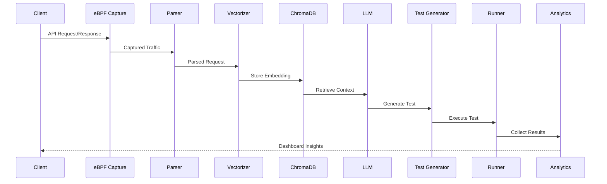

### 3.3 Data Transformation Rules

| Stage | Input | Transform | Output |
|-------|-------|-----------|--------|
| Capture | Raw bytes | Parse HTTP/gRPC | Request/Response object |
| Anonymization | Sensitive data | Replace with tokens | Sanitized payload |
| Vectorization | Text/JSON | Embed with model | 384-dim vector |
| Reasoning | Context + prompt | LLM inference | Structured response |
| Execution | Test definition | Playwright execute | Test result |
| Analytics | Raw results | Aggregate/Analyze | Metrics/Dashboard |

---

## 4. Agent Role Definitions

Specialized AI agents with clear boundaries to prevent logic overlap and resource contention.

### 4.1 Agent Taxonomy

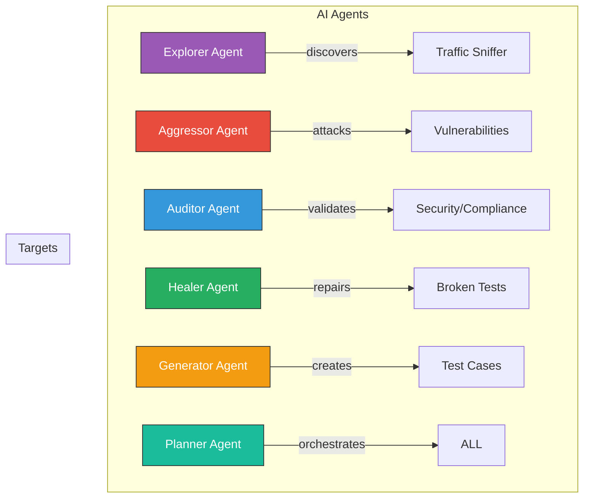

### 4.2 Explorer Agent

**Purpose:** Discover and map the testing landscape.

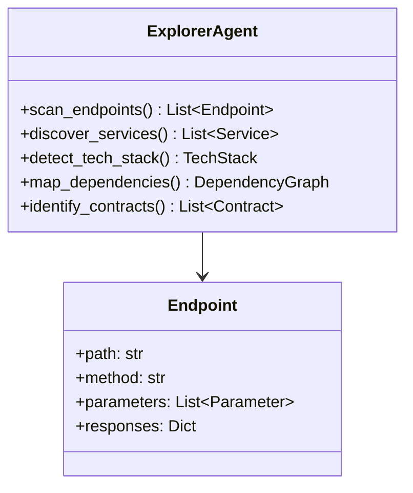

**Responsibilities:**
- API endpoint discovery
- Service mapping
- Technology stack detection
- Dependency graph construction
- Contract identification (OpenAPI, GraphQL, gRPC)

**Boundaries:**
- ❌ Does NOT execute tests
- ❌ Does NOT generate test code
- ❌ Does NOT modify existing tests

### 4.3 Aggressor Agent

**Purpose:** Push the system to its limits through various testing approaches.

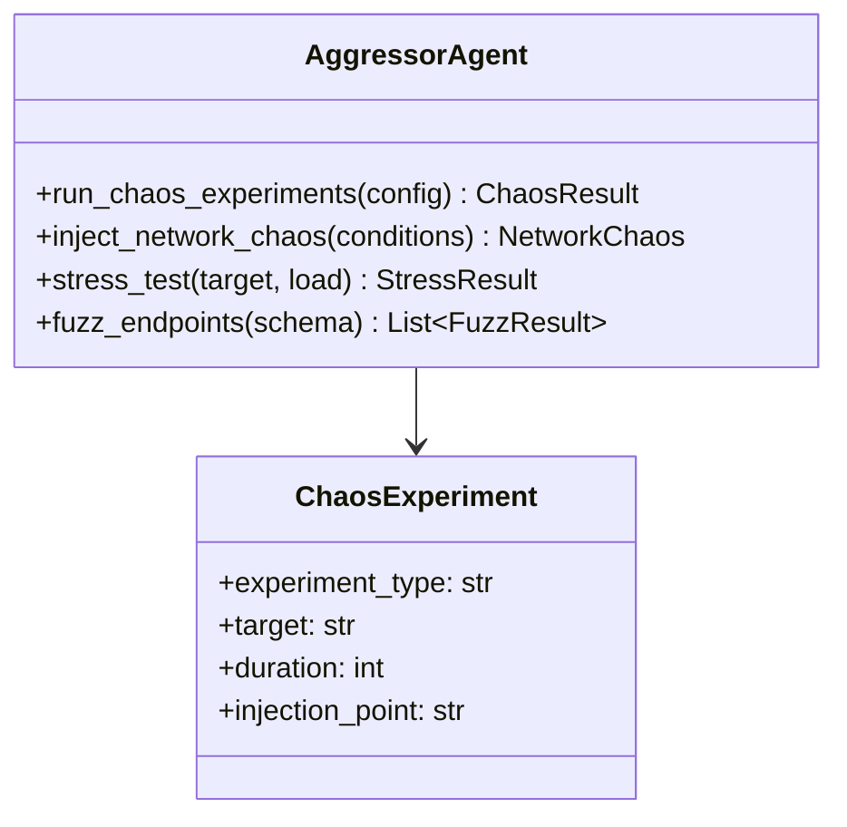

**Responsibilities:**
- Chaos engineering execution
- Stress and load testing
- Fuzzing campaigns
- Performance boundary testing

**Boundaries:**
- ❌ Does NOT discover endpoints
- ❌ Does NOT validate compliance
- ❌ Does NOT heal tests

### 4.4 Auditor Agent

**Purpose:** Validate security, compliance, and quality standards.

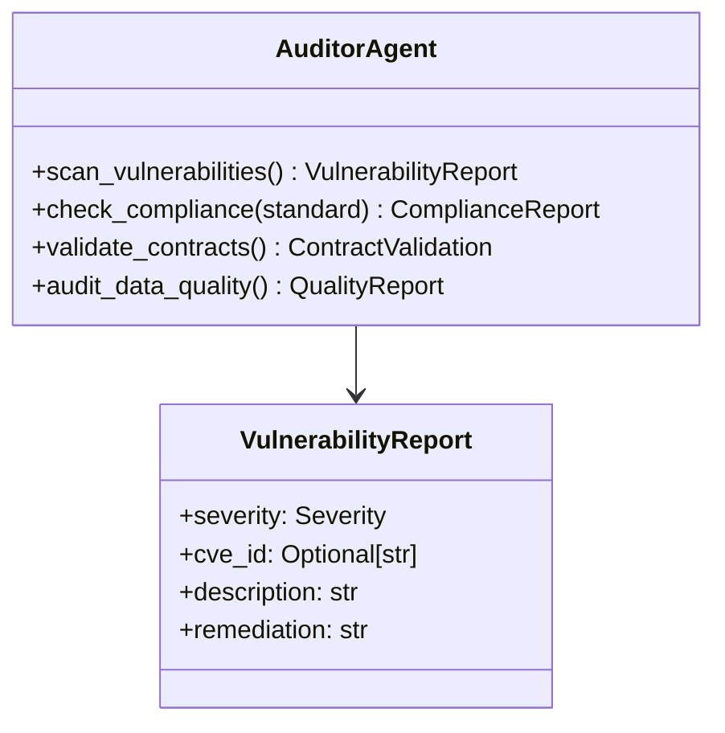

**Responsibilities:**
- OWASP vulnerability scanning
- Compliance validation (GDPR, PCI-DSS, HIPAA)
- Contract testing
- Data quality auditing

**Boundaries:**
- ❌ Does NOT execute chaos experiments
- ❌ Does NOT generate tests
- ❌ Does NOT repair tests

### 4.5 Healer Agent

**Purpose:** Automatically repair broken tests and adapt to system changes.

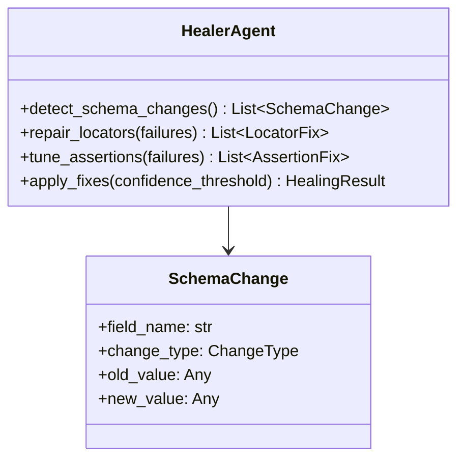

**Responsibilities:**
- API schema change detection
- Element locator repair
- Assertion threshold tuning
- Test optimization

**Boundaries:**
- ❌ Does NOT discover new endpoints
- ❌ Does NOT execute security scans
- ❌ Does NOT generate new tests (only repairs)

### 4.6 Agent Communication Protocol

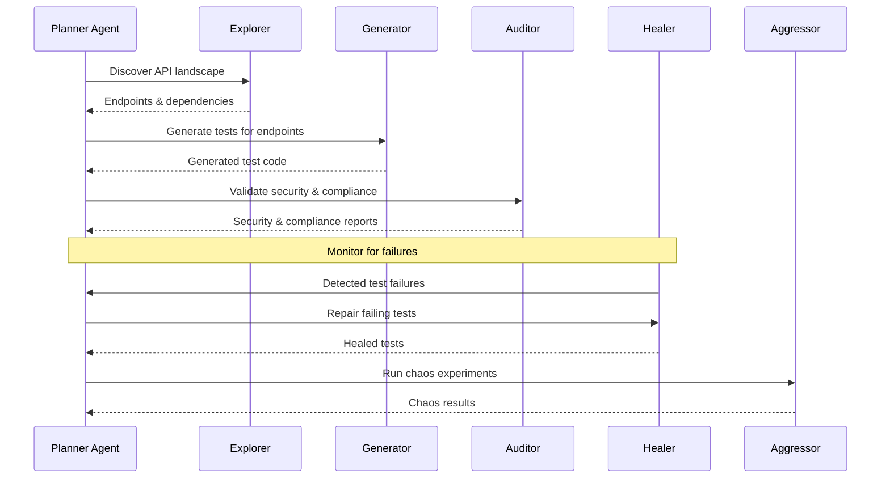

---

## 5. Contract Section: External API Ingestion

This section defines how external APIs (Postman, OpenAPI, curl) are ingested into the internal logic.

### 5.1 Supported Import Formats

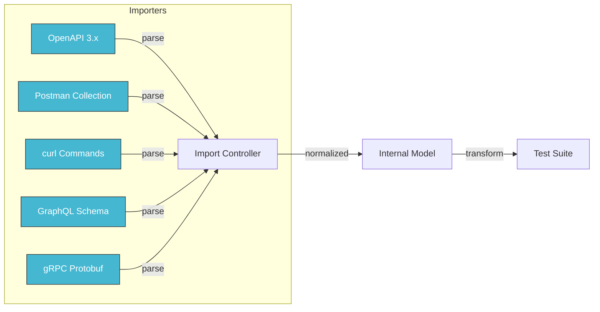

### 5.2 Import Pipeline

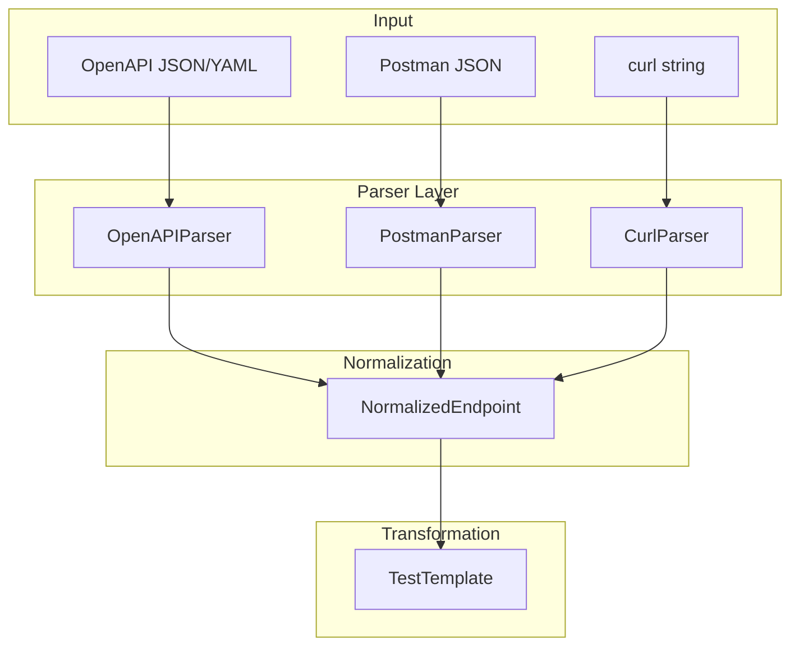

### 5.3 Contract Schema

```python
# Internal model for imported APIs
class ImportedEndpoint:
    path: str
    method: HttpMethod
    parameters: List[Parameter]
    request_body: Optional[RequestBody]
    responses: Dict[StatusCode, Response]
    security: List[SecurityScheme]
    
class TestTemplate:
    endpoint: ImportedEndpoint
    test_name: str
    assertions: List[Assertion]
    setup: Optional[TestStep]
    teardown: Optional[TestStep]
```

---

## 6. Module Registry

This registry is auto-generated by scanning the `/src/socialseed_e2e` directory.

### 6.1 Core Modules

| Module | Purpose | Dependencies |
|--------|---------|--------------|
| `core` | Base abstraction (BasePage, Orchestrator, Runner) | None |
| `commands` | CLI command implementation | core, config_loader |
| `templates` | Test scaffolding templates | core, jinja2 |

### 6.2 AI & Agents Modules

| Module | Purpose | Dependencies |
|--------|---------|--------------|
| `ai_orchestrator` | AI-driven test orchestration | core, ml |
| `ai_protocol` | Standardized agent communication | None |
| `agent_orchestrator` | Multi-agent coordination | ai_protocol, ai_orchestrator |
| `agents` | Specialized agent implementations | ai_protocol |
| `ai_learning` | Learning from test feedback | analytics |
| `ai_mocking` | AI-powered mocking | core, ml |

### 6.3 Testing Protocol Modules

| Module | Purpose | Dependencies |
|--------|---------|--------------|
| `graphql` | GraphQL testing | core |
| `grpc` | gRPC testing | core |
| `realtime` | WebSocket/SSE testing | core |
| `auth` | Authentication protocols | core |

### 6.4 Quality Assurance Modules

| Module | Purpose | Dependencies |
|--------|---------|--------------|
| `security` | Security testing (OWASP, pentest) | core |
| `chaos` | Chaos engineering | core |
| `performance` | Load & performance testing | core, observability |
| `visual_testing` | Visual regression testing | core |
| `contract_testing` | Contract testing (Pact) | core |

### 6.5 Data & Infrastructure Modules

| Module | Purpose | Dependencies |
|--------|---------|--------------|
| `database` | Database testing | core |
| `test_data` | Test data generation | core |
| `test_data_advanced` | Advanced data generation | test_data |
| `mocks` | Mock server & simulation | core |
| `distributed` | Distributed test execution | core |

### 6.6 Observability Modules

| Module | Purpose | Dependencies |
|--------|---------|--------------|
| `observability` | Metrics, tracing, logging | core |
| `analytics` | Test analytics & dashboards | observability |
| `telemetry` | Token/cost tracking | analytics |
| `reporting` | Report generation | core |

### 6.7 Integration Modules

| Module | Purpose | Dependencies |
|--------|---------|--------------|
| `ci_cd` | CI/CD pipeline templates | templates |
| `cloud` | Cloud provider integrations | core |
| `docker` | Docker support | core |
| `importers` | Import from Postman/OpenAPI | core |
| `recorder` | Record & replay sessions | core |

### 6.8 Advanced Features Modules

| Module | Purpose | Dependencies |
|--------|---------|--------------|
| `project_manifest` | Project knowledge management | ml |
| `shadow_runner` | Production traffic capture | traffic_sniffer |
| `traffic_sniffer` | Network traffic analysis | core |
| `traffic_vector_index` | Vector-based traffic search | project_manifest |
| `semantic_fuzzing` | AI-powered fuzzing | ml |
| `self_healing` | Self-repairing tests | ai_learning |
| `risk_analyzer` | Risk assessment | analytics |

---

## 7. Auto-Update Mechanism

The architecture documentation is maintained automatically by scanning the `/src` directory.

### 7.1 Update Script

```python
#!/usr/bin/env python3
"""
Architecture Auto-Update Script

This script scans the src/socialseed_e2e directory and automatically
updates the ARCHITECTURE.md file with new modules.

Usage:
    python scripts/update_architecture.py
"""

import os
import re
from pathlib import Path
from datetime import datetime

SRC_DIR = Path("src/socialseed_e2e")
ARCHITECTURE_FILE = Path("ARCHITECTURE.md")

def scan_modules():
    """Scan src directory for modules."""
    modules = []
    for item in SRC_DIR.iterdir():
        if item.is_dir() and not item.name.startswith('_'):
            modules.append({
                'name': item.name,
                'path': str(item.relative_to(SRC_DIR.parent)),
                'has_init': (item / '__init__.py').exists()
            })
    return sorted(modules, key=lambda x: x['name'])

def detect_dependencies(module_path):
    """Detect module dependencies from imports."""
    deps = set()
    for py_file in module_path.rglob("*.py"):
        if '__pycache__' in str(py_file):
            continue
        content = py_file.read_text()
        # Extract imports
        import_pattern = r'from socialseed_e2e\.(\w+)'
        matches = re.findall(import_pattern, content)
        deps.update(matches)
    return sorted(deps)

def update_module_registry(modules):
    """Update the Module Registry section in ARCHITECTURE.md."""
    # Implementation to parse and update the markdown
    pass

def main():
    print("Scanning src/socialseed_e2e for modules...")
    modules = scan_modules()
    print(f"Found {len(modules)} modules")
    
    for module in modules:
        deps = detect_dependencies(SRC_DIR / module['name'])
        module['dependencies'] = deps
    
    # Update ARCHITECTURE.md
    # (Implementation to update specific sections)
    
    print(f"Updated {ARCHITECTURE_FILE}")

if __name__ == "__main__":
    main()
```

### 7.2 CI/CD Integration

```yaml
# .github/workflows/update-architecture.yml
name: Update Architecture Docs

on:
  push:
    branches: [main]
    paths:
      - 'src/socialseed_e2e/**'
  schedule:
    - cron: '0 0 * * *'  # Daily at midnight

jobs:
  update:
    runs-on: ubuntu-latest
    steps:
      - uses: actions/checkout@v4
      - name: Setup Python
        uses: actions/setup-python@v5
        with:
          python-version: '3.11'
      - name: Run Update Script
        run: python scripts/update_architecture.py
      - name: Commit Changes
        uses: stefanzweifel/git-auto-commit-action@v4
        with:
          commit_message: "docs: Auto-update ARCHITECTURE.md"
```

### 7.3 Consistency Check Workflow

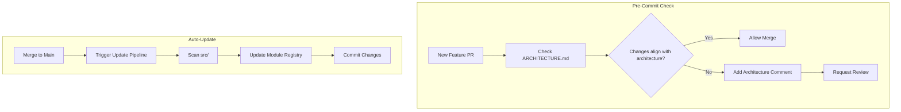

---

## Appendix: Version History

| Version | Date | Changes | Author |
|---------|------|---------|--------|
| 1.0.0 | 2026-02-19 | Initial architecture documentation | OpenCode |

---

*This document is maintained by AI agents. For updates, run `python scripts/update_architecture.py` or trigger the GitHub workflow.*
