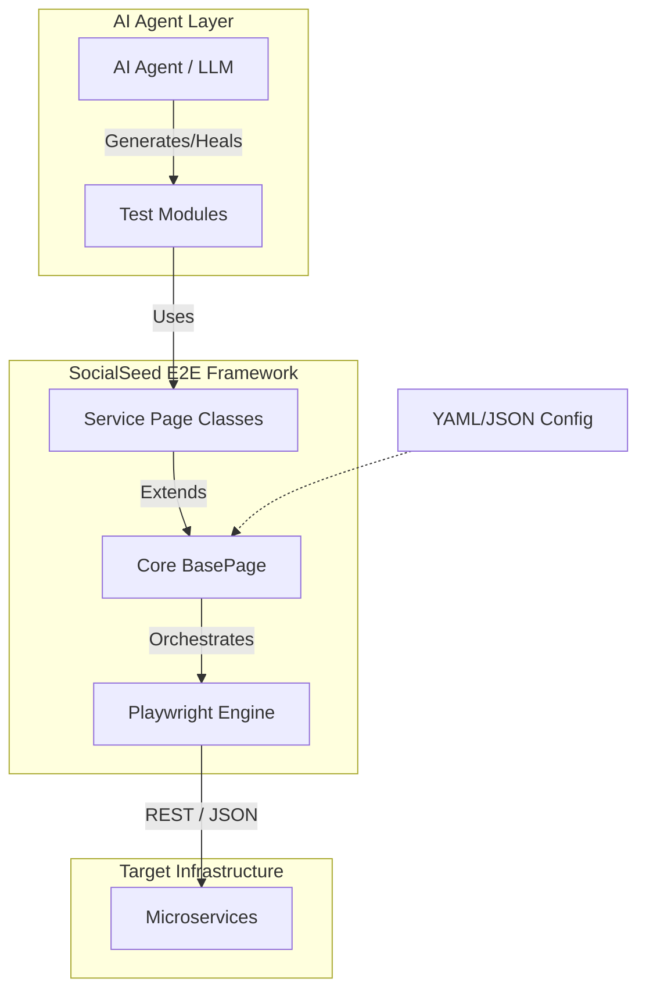

# 🌱 socialseed-e2e

[](https://pypi.org/project/socialseed-e2e/)
[](https://pypi.org/project/socialseed-e2e/)
[](https://github.com/daironpf/socialseed-e2e/actions)
[](LICENSE)
[](https://pypi.org/project/socialseed-e2e/)

> **The ultimate E2E testing framework for REST APIs - Built for developers and AI agents**

**One-liner:** Test your REST APIs with 10x less code using intelligent scaffolding, automatic test discovery, and stateful test chaining. Perfect for both manual testing and AI-generated test suites.

---

## 📑 Table of Contents

- [Features](#-key-features)
- [Installation](#-installation)
- [Quick Start](#-quick-start-5-minutes)
- [Hello World Example](#-hello-world-example)
- [Why socialseed-e2e](#-why-socialseed-e2e)
- [Architecture](#-architecture)
- [Advanced Usage](#-advanced-usage)
- [Testing](#-testing)
- [Comparison](#-comparison-with-alternatives)
- [API Documentation](#-api-documentation)
- [Contributing](#-contributing)
- [Roadmap](#-roadmap)
- [License](#-license)

---

## 🤖 Engineered for LLM Reasoning

Traditional testing tools are "token-hungry" because they force AI to handle raw HTTP strings and boilerplate. **socialseed-e2e** introduces a high-level abstraction layer that:

* **Minimizes Token Consumption**: By using structured `IServicePage` protocols, the agent only processes business logic, not implementation noise.
* **Enhanced Contextual Awareness**: Models like **GPT-4o, Claude 3.5, or Mistral Large** can reason about complex API flows and state transitions.
* **Self-Healing Capabilities**: The structured architecture allows the AI to identify and fix broken tests by understanding the underlying service contract.

---

**socialseed-e2e** is a powerful, service-agnostic End-to-End (E2E) testing framework designed to make API testing effortless, scalable, and maintainable. Whether you're a developer writing tests manually or an AI agent generating test suites automatically, this framework provides the perfect foundation for reliable API testing.

## 🚀 Why socialseed-e2e?

### For Developers
- **Zero boilerplate**: Start testing in minutes with intelligent scaffolding
- **Playwright-powered**: Rock-solid HTTP testing with browser-like reliability
- **Modular architecture**: Organize tests by service, share state between modules
- **Beautiful CLI**: Rich terminal output with progress bars and detailed reports
- **Type-safe**: Full Pydantic validation and Python type hints

### For AI Agents
- **Structured protocols**: Clear interfaces (`IServicePage`, `ITestModule`) for code generation
- **Auto-discovery**: Tests are automatically found and executed based on directory structure
- **Template system**: Generate consistent test modules with variable substitution
- **Hexagonal architecture**: Core engine is completely decoupled from service logic
- **Configuration-driven**: All settings in YAML/JSON with environment variable support

## ✨ Key Features

- 🔥 **Service-Agnostic Core**: Test any REST API without framework modifications
- 🎯 **Playwright Integration**: Use the same tool for API and UI testing (future-ready)
- 📝 **Smart Scaffolding**: `e2e new-service` and `e2e new-test` commands
- 🔍 **Auto-Discovery**: No manual test registration required
- 🎨 **Rich CLI Output**: Beautiful terminal reports with tables and progress
- 🔧 **Environment Support**: Dev, staging, production configurations
- 📊 **Test Orchestration**: Run tests in logical order with proper cleanup
- 🏗️ **Hexagonal Architecture**: Clean separation of concerns
- 🤖 **AI-Ready**: Perfect for automated test generation workflows
- 🧪 **Built-in Mock API**: Flask-based mock server for testing without dependencies
- 📈 **Coverage Reports**: Automatic coverage tracking with codecov.io integration

## 📦 Installation

```bash
pip install socialseed-e2e
playwright install chromium
```

For development:
```bash
git clone https://github.com/daironpf/socialseed-e2e.git
cd socialseed-e2e
pip install -e ".[dev]"
playwright install chromium
```

## 🏃 Quick Start (5 minutes)

### 1. Initialize Your Project

```bash
e2e init my-api-tests
cd my-api-tests
```

This creates:
```
my-api-tests/
├── e2e.conf          # Configuration file
├── services/         # Service test implementations
└── tests/           # Test modules
```

### 2. Configure Your API

Edit `e2e.conf`:

```yaml
general:
  environment: dev
  timeout: 30000
  verbose: true

services:
  users-api:
    name: users-service
    base_url: http://localhost:8080
    health_endpoint: /health
    timeout: 5000
    required: true
```

### 3. Create Your First Service

```bash
e2e new-service users-api
```

Generates:
```
services/
└── users-api/
    ├── __init__.py
    ├── users_api_page.py      # Service page class
    ├── data_schema.py         # DTOs and constants
    └── modules/               # Test modules
        └── __init__.py
```

### 4. Create a Test Module

```bash
e2e new-test login --service users-api
```

This creates `services/users-api/modules/01_login_flow.py`:

```python
from playwright.sync_api import APIResponse
from typing import TYPE_CHECKING

if TYPE_CHECKING:
    from ..users_api_page import UsersApiPage

def run(users_api: 'UsersApiPage') -> APIResponse:
    """
    Test user login flow.
    
    Args:
        users_api: Instance of UsersApiPage
    
    Returns:
        APIResponse: HTTP response
    """
    print("Running login test...")
    
    # Arrange
    credentials = {"email": "test@example.com", "password": "secret123"}
    
    # Act
    response = users_api.post("/auth/login", json=credentials)
    
    # Assert
    if response.ok:
        data = response.json()
        users_api.auth_token = data["token"]  # Share state!
        print(f"✓ Login successful! Token: {data['token'][:20]}...")
    else:
        print(f"✗ Login failed: {response.status}")
        raise AssertionError(f"Expected 200, got {response.status}")
    
    return response
```

### 5. Run Your Tests

```bash
e2e run
```

Output:
```
🚀 socialseed-e2e v0.1.0
═══════════════════════════════════════

📋 Configuration: e2e.conf
🌍 Environment: dev

🔍 Discovering services...
✓ Found 1 service: users-api

📦 Service: users-api
─────────────────────────────────────
🧪 Running 1 test module(s)

[1/1] 01_login_flow.py
Running login test...
✓ Login successful! Token: eyJhbGciOiJIUzI1Ni...
✓ PASSED

─────────────────────────────────────
✅ All tests passed! (1/1)
⏱️  Duration: 0.42s

═══════════════════════════════════════
🎉 Test run completed successfully!
```

## 👋 Hello World Example

The simplest possible test with socialseed-e2e:

```python
# services/my-api/modules/01_hello_world.py
def run(api):
    """Test that our API is alive."""
    response = api.get("/health")
    assert response.status == 200
    print("✓ API is healthy!")
    return response
```

That's it! 5 lines of code vs 30+ lines with traditional testing tools.

**What you get for free:**
- ✅ Automatic retry with exponential backoff
- ✅ Rate limiting protection
- ✅ Request/response logging
- ✅ Beautiful terminal output
- ✅ State sharing between tests
- ✅ Error handling and reporting

## 🏗️ Architecture

### High-Level Flow



```
socialseed-e2e/
├── core/                    # Service-agnostic engine
│   ├── base_page.py        # HTTP abstraction layer
│   ├── config_loader.py    # Configuration management
│   ├── test_orchestrator.py # Test discovery & execution
│   ├── interfaces.py       # Protocols for AI/codegen
│   └── loaders.py          # Dynamic module loading
├── services/               # Your service implementations
│   └── users-api/
│       ├── users_api_page.py
│       ├── data_schema.py
│       └── modules/
│           ├── 01_login_flow.py
│           ├── 02_register_flow.py
│           └── 03_profile_flow.py
└── templates/              # Scaffolding templates
```

## 🎨 Advanced Usage

### Chaining Tests with Shared State

```python
# 01_create_user_flow.py
def run(users_api: 'UsersApiPage') -> APIResponse:
    response = users_api.post("/users", json={"name": "John"})
    users_api.current_user = response.json()  # Store for next test
    return response

# 02_update_user_flow.py
def run(users_api: 'UsersApiPage') -> APIResponse:
    user_id = users_api.current_user["id"]  # Access from previous test
    return users_api.put(f"/users/{user_id}", json={"name": "Jane"})
```

### Running Specific Services

```bash
# Run all tests
e2e run

# Run specific service
e2e run --service users-api

# Run specific module
e2e run --service users-api --module login

# Verbose output
e2e run --verbose
```

### Environment-Specific Configuration

```bash
# Use different config files
E2E_CONFIG_PATH=e2e.prod.conf e2e run

# Or use environment variables in config
services:
  api:
    base_url: ${API_BASE_URL:-http://localhost:8080}
```

## 🧪 Testing

The framework includes a comprehensive test suite with **420+ tests** organized for maintainability:

### Test Organization

```
tests/
├── unit/                      # Unit tests for core components
│   ├── test_base_page.py     # HTTP client tests
│   ├── test_config_loader.py # Configuration tests
│   ├── test_loaders.py       # Module loader tests
│   ├── test_orchestrator.py  # Test orchestration tests
│   ├── test_template_engine.py # Template system tests
│   ├── test_validators.py    # Validation helper tests
│   └── test_imports_compatibility.py # Import system tests
│
└── integration/               # Integration tests
    └── cli/                   # CLI command tests (organized by command)
        ├── test_init.py       # 'e2e init' tests
        ├── test_new_service.py # 'e2e new-service' tests
        ├── test_new_test.py   # 'e2e new-test' tests
        ├── test_run.py        # 'e2e run' tests
        ├── test_doctor.py     # 'e2e doctor' tests
        ├── test_config.py     # 'e2e config' tests
        ├── test_error_handling.py # Error handling tests
        └── test_workflows.py  # End-to-end workflows
```

### Running Tests

```bash
# Run all tests
pytest

# Run unit tests only
pytest tests/unit/
# Or using markers:
pytest -m unit

# Run integration tests
pytest tests/integration/
# Or using markers:
pytest -m integration

# Run CLI integration tests
pytest tests/integration/cli/
# Or using markers:
pytest -m cli

# Run tests for specific command
pytest tests/integration/cli/test_init.py

# Run with coverage report (minimum 80%)
pytest --cov=socialseed_e2e --cov-report=html

# Run excluding slow tests
pytest -m "not slow"

# Run specific marker combinations
pytest -m "unit and not slow"
```

**Available Test Markers:**
- `@pytest.mark.unit` - Fast, isolated unit tests
- `@pytest.mark.integration` - Integration tests
- `@pytest.mark.slow` - Long-running tests
- `@pytest.mark.cli` - CLI command tests
- `@pytest.mark.mock_api` - Tests using the mock Flask API

**Coverage Reports:** Automatically uploaded to [codecov.io](https://codecov.io/gh/daironpf/socialseed-e2e) on each CI run (minimum 80% coverage required).

📚 **Detailed testing documentation:** [docs/testing-guide.md](docs/testing-guide.md)

### Mock API for Integration Testing

The framework includes a built-in **Flask-based Mock API** for testing without external dependencies:

```bash
# Start the mock API server
python tests/fixtures/mock_api.py
```

**Features:**
- Health check endpoint (`GET /health`)
- Complete user CRUD operations (`/api/users`)
- Authentication system (`/api/auth/login`, `/api/auth/register`)
- Pre-seeded test data (admin and user accounts)
- Pytest fixtures for automated testing

**Quick Test with Mock API:**
```python
def test_health(mock_api_url):
    response = requests.get(f"{mock_api_url}/health")
    assert response.status_code == 200
```

**Available Fixtures:**
- `mock_api_url` - Base URL (http://localhost:8765)
- `mock_api_reset` - Reset data before each test
- `sample_user_data` - Sample user data
- `admin_credentials` / `user_credentials` - Pre-configured accounts

📚 **Full documentation:** [tests/fixtures/README.md](tests/fixtures/README.md)  
📖 **For AI Agents:** [docs/mock-api.md](docs/mock-api.md) - Detailed guide with patterns and best practices

## 🧩 Comparison with Alternatives

| Feature | socialseed-e2e | Postman | pytest + requests | Karate |
|---------|---------------|---------|-------------------|--------|
| **Code-based** | ✅ Python | ❌ GUI/JavaScript | ✅ Python | ❌ Java/Gherkin |
| **Test Chaining** | ✅ Stateful | ❌ Manual | ⚠️ DIY | ✅ Built-in |
| **Auto Discovery** | ✅ Yes | ❌ Manual | ❌ Manual | ✅ Yes |
| **CLI Tool** | ✅ Rich CLI | ⚠️ Newman | ❌ DIY | ✅ Yes |
| **Scaffolding** | ✅ Yes | ❌ No | ❌ No | ⚠️ Templates |
| **AI-Ready** | ✅ Designed for AI | ❌ No | ❌ No | ❌ No |
| **Mock API** | ✅ Built-in | ❌ Separate | ❌ DIY | ⚠️ Limited |
| **Coverage** | ✅ Built-in | ❌ No | ⚠️ Plugin | ❌ No |
| **Type Safety** | ✅ Pydantic | ❌ No | ⚠️ Optional | ❌ No |
| **Learning Curve** | 🟢 Low | 🟢 Low | 🟡 Medium | 🟡 Medium |

**When to use socialseed-e2e:**
- You want **10x less code** than traditional approaches
- You need **stateful test chaining** across multiple API calls
- You're building **AI-generated test suites**
- You want a **CLI-first** workflow
- You need **built-in mocking** without external dependencies
- You want **professional-grade reporting** out of the box

**When to use alternatives:**
- **Postman**: Best for manual API exploration and quick one-off tests
- **pytest + requests**: Best when you need full control and custom logic
- **Karate**: Best for teams already using JVM ecosystem

## 📚 API Documentation

- **[Installation Guide](docs/installation.md)** - Detailed installation instructions
- **[Quick Start](docs/quickstart.md)** - Get up and running in 15 minutes
- **[Configuration](docs/configuration.md)** - e2e.conf options and examples
- **[Writing Tests](docs/writing-tests.md)** - Test writing patterns and best practices
- **[CLI Reference](docs/cli-reference.md)** - Complete CLI command reference
- **[API Reference](docs/api-reference.md)** - Framework API documentation
- **[Testing Guide](docs/testing-guide.md)** - Pytest configuration and test execution
- **[Mock API](docs/mock-api.md)** - Using the built-in Flask mock API

## 🤝 Contributing

We welcome contributions from developers and AI agents! Please read our:

📋 **[Contributing Guidelines](CONTRIBUTING.md)** - How to contribute code, report bugs, and suggest features  
🤖 **[AGENTS.md](AGENTS.md)** - Special guide for AI agents contributing to this project  
📜 **[AI_CONTRIBUTORS.md](AI_CONTRIBUTORS.md)** - Recognition for AI agent contributions

### Quick Contribution Steps

```bash
# Fork and clone
git clone https://github.com/daironpf/socialseed-e2e.git
cd socialseed-e2e

# Install dev dependencies
pip install -e ".[dev]"

# Run tests
pytest

# Make changes and run tests again
pytest

# Submit PR
```

### Development Commands

```bash
# Run tests
pytest

# Run only unit tests
pytest tests/unit/

# Run only integration tests
pytest tests/integration/

# Run with coverage
pytest --cov=socialseed_e2e --cov-report=html

# Run linting
black src/ tests/
flake8 src/ tests/
mypy src/socialseed_e2e
```

## 🚦 Project Status

- ✅ **Core Framework**: Complete and tested
- ✅ **CLI Commands**: init, new-service, new-test, run, doctor, config
- ✅ **Configuration**: YAML/JSON with environment variables
- ✅ **Mock API**: Flask-based server for integration testing
- ✅ **CI/CD**: GitHub Actions configured
- 🚧 **HTML Reports**: In development
- 🚧 **Parallel Execution**: In development
- 📋 **Plugin System**: Planned

---

## ⚡ Seeking API Partnerships

**socialseed-e2e** is currently in a high-growth phase, focusing on **Autonomous Self-Healing Tests**. Due to geographic and resource constraints, we are actively looking for **API Credits or Partnerships** (OpenAI, Anthropic, Google Cloud, Mistral) to stress-test our reasoning engine with large-scale microservice architectures.

> [!TIP]
> **If you represent an AI provider** and want to see your model as the default engine for AI-native E2E testing, we would love to collaborate. Let's push the boundaries of autonomous engineering together.

## 🗺️ Roadmap

### v0.1.0 (Current)
- ✅ Core framework
- ✅ Basic CLI
- ✅ Configuration system
- ✅ Mock API server

### v0.2.0 (Next)
- 🚧 HTML reports with detailed metrics
- 🚧 Parallel test execution
- 🚧 Better authentication handling
- 🚧 WebSocket support

### v0.3.0 (Planned)
- 📋 Plugin system for custom extensions
- 📋 Docker integration
- 📋 Visual regression testing
- 📋 Performance testing metrics

### v0.4.0 (Future)
- 📋 WebSocket support
- 📋 GraphQL support
- 📋 gRPC testing support
- 📋 AI-powered test healing

## 💬 Community

- **GitHub Discussions**: [Join the conversation](https://github.com/daironpf/socialseed-e2e/discussions)
- **Issues**: [Report bugs or request features](https://github.com/daironpf/socialseed-e2e/issues)

## ⭐ Star Us!

If you find socialseed-e2e helpful, please give us a star on GitHub! It helps others discover the project and motivates continued development.

```bash
# Star the repo
git clone https://github.com/daironpf/socialseed-e2e.git
cd socialseed-e2e
# Then click the ⭐ star button!
```

## 🤖 AI Contributors

This project recognizes AI agents as legitimate co-authors. Current AI contributors:

- **[OpenCode AI Agent](https://github.com/anomalyco)** - Framework architecture, core implementation, test suite
- **Claude (Anthropic)** - Documentation, feature suggestions, bug fixes

See [AI_CONTRIBUTORS.md](AI_CONTRIBUTORS.md) for full details.

## 💝 Acknowledgments

- **Playwright team** for the amazing HTTP testing engine
- **Pydantic team** for type-safe data validation
- **Rich team** for beautiful terminal output
- **All contributors** who have helped improve this project

## 📜 License

MIT License - see [LICENSE](LICENSE) file for details.

---

<p align="center">
  <b>Built with ❤️ by developers, for developers and AI agents</b>
</p>
