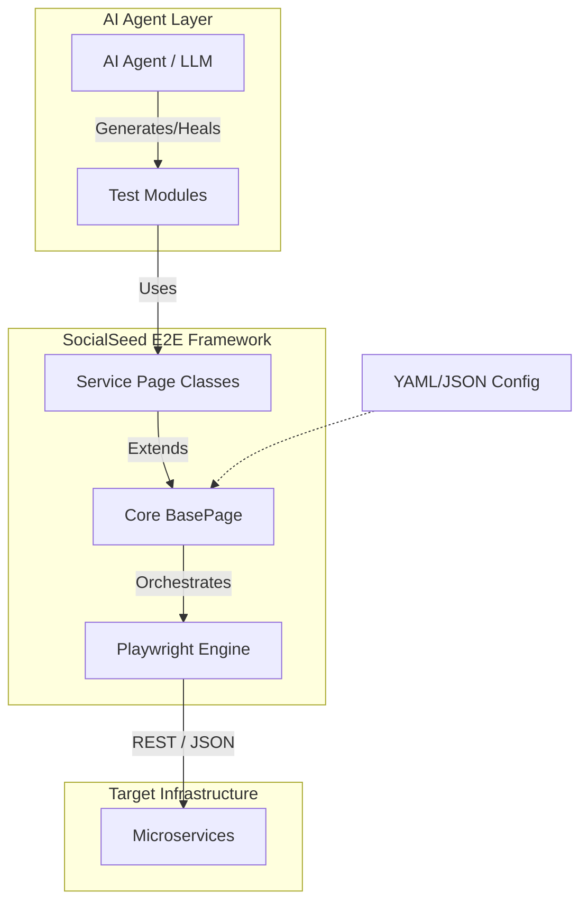

# 🌱 socialseed-e2e

[](https://pypi.org/project/socialseed-e2e/)
[](https://pypi.org/project/socialseed-e2e/)
[](https://daironpf.github.io/socialseed-e2e/)
[](LICENSE)
[](https://pypi.org/project/socialseed-e2e/)

> **The ultimate E2E testing framework for REST APIs - Built for developers and AI agents**

**One-liner:** Test your REST APIs with 10x less code using intelligent scaffolding, automatic test discovery, and stateful test chaining. Perfect for both manual testing and AI-generated test suites.

📚 **[Full Documentation](https://daironpf.github.io/socialseed-e2e/)** | 🚀 **[Quick Start](https://daironpf.github.io/socialseed-e2e/quickstart.html)** | 📖 **[Installation](https://daironpf.github.io/socialseed-e2e/installation.html)**

---

## 🎯 What is socialseed-e2e?

**socialseed-e2e** is a service-agnostic End-to-End (E2E) testing framework designed to make API testing effortless, scalable, and maintainable. Built with an hexagonal architecture that decouples the core engine from service logic, it enables both developers and AI agents to write reliable tests with minimal boilerplate.

### Key Differentiators

- **🤖 AI-Native Architecture**: Structured protocols (`IServicePage`, `ITestModule`) designed for automated test generation
- **🧠 .agent Awareness**: Automatically generates AI documentation (`.agent/`) for self-guided test generation by LLMs
- **⚡ 10x Less Code**: Stateful test chaining and automatic discovery eliminate boilerplate
- **🧪 Built-in Mocking**: Flask-based mock API for testing without external dependencies
- **🔧 Zero Configuration**: Sensible defaults with YAML/JSON override support

---

## 🏗️ Architecture

### Hexagonal Design

```
socialseed-e2e/
├── core/                    # Service-agnostic engine (stable, tested)
│   ├── base_page.py        # HTTP abstraction layer (Playwright)
│   ├── config_loader.py    # Configuration management
│   ├── test_orchestrator.py # Test discovery & execution
│   ├── interfaces.py       # Protocols for AI/codegen
│   └── loaders.py          # Dynamic module loading
├── services/               # Your service implementations
│   └── users-api/
│       ├── users_api_page.py
│       ├── data_schema.py
│       └── modules/
│           ├── 01_login_flow.py
│           ├── 02_register_flow.py
│           └── 03_profile_flow.py
└── templates/              # Scaffolding templates
```

### High-Level Flow



---

## ✨ Key Features

- 🔥 **Service-Agnostic Core**: Test any REST API without framework modifications
- 🎯 **Playwright Integration**: Rock-solid HTTP testing with browser-like reliability
- 📝 **Smart Scaffolding**: `e2e new-service` and `e2e new-test` commands
- 🔍 **Auto-Discovery**: Tests automatically found and executed
- 🎨 **Rich CLI Output**: Beautiful terminal reports with tables and progress
- 🔧 **Environment Support**: Dev, staging, production configurations
- 📊 **Test Orchestration**: Run tests in logical order with state sharing
- 🏗️ **Hexagonal Architecture**: Clean separation of concerns
- 🤖 **AI-Ready**: Perfect for automated test generation workflows
- 🧪 **Built-in Mock API**: Flask-based mock server for testing without dependencies
- 📈 **Coverage Reports**: Automatic coverage tracking with codecov.io integration
- ⚡ **State Chaining**: Share state between tests naturally

---

## 🚀 Quick Start

```bash
# Install
pip install socialseed-e2e
playwright install chromium

# Initialize project
e2e init my-api-tests
cd my-api-tests

# Create service and test
e2e new-service users-api
e2e new-test login --service users-api

# Run tests
e2e run
```

📚 **[Complete Quick Start Guide →](https://daironpf.github.io/socialseed-e2e/quickstart.html)**

---

## 📦 Installation

```bash
pip install socialseed-e2e
playwright install chromium
```

For development:
```bash
git clone https://github.com/daironpf/socialseed-e2e.git
cd socialseed-e2e
pip install -e ".[dev]"
playwright install chromium
```

📖 **[Detailed Installation →](https://daironpf.github.io/socialseed-e2e/installation.html)**

---

## 🧪 Testing

The framework includes **420+ tests** organized for maintainability:

```bash
# Run all tests
pytest

# Run by type
pytest -m unit                    # Unit tests
pytest -m integration             # Integration tests
pytest -m cli                     # CLI tests

# With coverage
pytest --cov=socialseed_e2e --cov-report=html
```

📚 **[Testing Guide →](https://daironpf.github.io/socialseed-e2e/testing-guide.html)**

---

## 🚦 Project Status

### Current (v0.1.0)
- ✅ **Core Framework**: Complete and tested (86.39% coverage)
- ✅ **CLI Commands**: init, new-service, new-test, run, doctor, config
- ✅ **Configuration**: YAML/JSON with environment variables
- ✅ **Mock API**: Flask-based server for integration testing
- ✅ **CI/CD**: GitHub Actions configured (CI, Release, Docs)
- ✅ **Documentation**: Complete guides hosted on GitHub Pages

### In Progress
- 🚧 HTML reports with detailed metrics
- 🚧 Parallel test execution
- 🚧 Better authentication handling
- 🚧 WebSocket support

### Planned
- 📋 Plugin system for custom extensions
- 📋 Docker integration
- 📋 Visual regression testing
- 📋 Performance testing metrics
- 📋 GraphQL and gRPC support

---

## 🤝 Contributing

We welcome contributions from developers and AI agents!

- 📋 **[Contributing Guidelines](CONTRIBUTING.md)** - How to contribute
- 🤖 **[AGENTS.md](AGENTS.md)** - Guide for AI agents
- 📜 **[AI_CONTRIBUTORS.md](AI_CONTRIBUTORS.md)** - Recognition for AI contributions

### Quick Start for Contributors

```bash
git clone https://github.com/daironpf/socialseed-e2e.git
cd socialseed-e2e
pip install -e ".[dev]"
pytest  # Run tests
# Make changes
pytest  # Verify
# Submit PR
```

---

## 🤖 AI Contributors

This project recognizes AI agents as legitimate co-authors:

- **[OpenCode AI Agent](https://github.com/anomalyco)** - Framework architecture, core implementation, CLI, templates, documentation
- **Claude (Anthropic)** - Documentation, feature suggestions, bug fixes

See [AI_CONTRIBUTORS.md](AI_CONTRIBUTORS.md) for full details and contribution philosophy.

---

## 🤖 Workflow with AI Agents

socialseed-e2e is designed to be the first **AI-Native Testing Framework**. When you initialize a project with `e2e init`, a `.agent/` folder is created with specific instructions for LLMs (Claude, GPT-4, etc.).

### How to use it:

1. **Initialize**: Run `e2e init` in your project root.
2. **Prompt your Agent**:
   > "Read the documentation in the `.agent/` folder to understand the testing framework. Then, scan my API controllers in `src/controllers/` and generate the corresponding E2E tests following the framework patterns."
3. **Execute**: Run `e2e run` to verify the generated tests.

The `.agent` folder contains:
- `FRAMEWORK_CONTEXT.md`: Architecture and core concepts.
- `WORKFLOW_GENERATION.md`: Step-by-step guide for generating tests.
- `EXAMPLE_TEST.md`: Gold standard code examples.

---

## 📚 Documentation

All documentation is hosted on **GitHub Pages** and automatically deployed on every push to main:

🔗 **[https://daironpf.github.io/socialseed-e2e/](https://daironpf.github.io/socialseed-e2e/)**

### Documentation Sections

- **[Installation Guide](https://daironpf.github.io/socialseed-e2e/installation.html)** - Detailed setup instructions
- **[Quick Start](https://daironpf.github.io/socialseed-e2e/quickstart.html)** - Get running in 15 minutes
- **[Configuration](https://daironpf.github.io/socialseed-e2e/configuration.html)** - Complete e2e.conf reference
- **[Writing Tests](https://daironpf.github.io/socialseed-e2e/writing-tests.html)** - Patterns and best practices
- **[CLI Reference](https://daironpf.github.io/socialseed-e2e/cli-reference.html)** - All commands and options
- **[API Reference](https://daironpf.github.io/socialseed-e2e/api-reference.html)** - Framework API documentation
- **[Testing Guide](https://daironpf.github.io/socialseed-e2e/testing-guide.html)** - Pytest configuration and execution
- **[Mock API](https://daironpf.github.io/socialseed-e2e/mock-api.html)** - Built-in Flask mock server guide

### Local Documentation

```bash
pip install ".[docs]"
cd docs && make html
open _build/html/index.html
```

---

## 🗺️ Roadmap

### v0.2.0 (Next)
- HTML reports with detailed metrics
- Parallel test execution
- Better authentication handling
- WebSocket support

### v0.3.0 (Planned)
- Plugin system for custom extensions
- Docker integration
- Visual regression testing
- Performance testing metrics

### v0.4.0 (Future)
- GraphQL support
- gRPC testing support
- AI-powered test healing
- Advanced visual testing

---

## 💬 Community

- **GitHub Discussions**: [Join the conversation](https://github.com/daironpf/socialseed-e2e/discussions)
- **Issues**: [Report bugs or request features](https://github.com/daironpf/socialseed-e2e/issues)
- **Documentation**: [https://daironpf.github.io/socialseed-e2e/](https://daironpf.github.io/socialseed-e2e/)

---

## 📜 License

MIT License - see [LICENSE](LICENSE) file for details.

---

<p align="center">
  <b>Built with ❤️ by Dairon Pérez Frías (@daironpf) and AI co-authors</b><br>
  <sub>For developers and AI agents who believe in better testing</sub>
</p>
